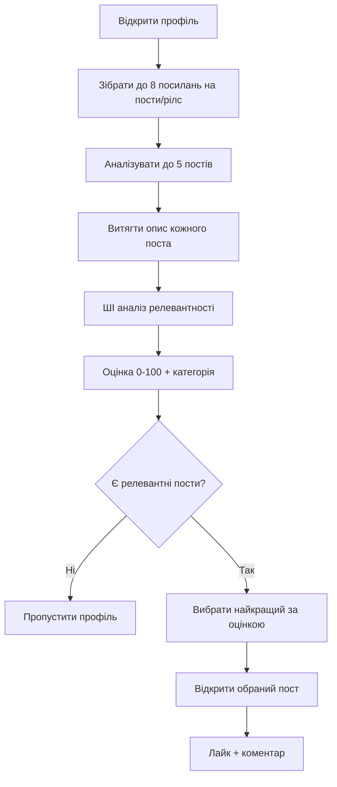

# Покращена система фільтрації контенту v2.0

## 🚀 Основні покращення

### Раніше (v1.0):
- ❌ Аналізував тільки **один** пост з профілю
- ❌ Якщо пост не релевантний → пропускав **весь профіль**
- ❌ Не враховував інші потенційно релевантні пости

### Тепер (v2.0):
- ✅ Аналізує **до 5 постів** з профілю
- ✅ Вибирає **найкращий** за оцінкою релевантності
- ✅ Пропускає профіль тільки якщо **жоден** пост не релевантний
- ✅ Підготовлено для аналізу зображень

## 🔍 Як працює новий алгоритм



## 📊 Приклад роботи

```
🔍 Collecting post and reel links...
Found 6 unique posts/reels for analysis

🔍 Analyzing post 1/5: https://www.instagram.com/p/ABC123/
📊 Post analysis: Score=85, Relevant=true, Category=residential
📝 Reason: Post discusses apartment sale and investment opportunities

🔍 Analyzing reel 2/5: https://www.instagram.com/reel/DEF456/
📊 Reel analysis: Score=25, Relevant=false, Category=not_relevant
📝 Reason: Content about family vacation, not related to real estate

🔍 Analyzing post 3/5: https://www.instagram.com/p/GHI789/
📊 Post analysis: Score=92, Relevant=true, Category=commercial
📝 Reason: Commercial office space listing with detailed specifications

🔍 Analyzing post 4/5: https://www.instagram.com/p/JKL012/
📊 Post analysis: Score=78, Relevant=true, Category=renovation
📝 Reason: Kitchen renovation showcasing property improvements

🔍 Analyzing post 5/5: https://www.instagram.com/p/MNO345/
📊 Post analysis: Score=15, Relevant=false, Category=not_relevant
📝 Reason: Personal photo with friends, no real estate context

✅ Selected best content: post with score 92
📝 Selection reason: Commercial office space listing with detailed specifications
✅ Opening best relevant post (Score: 92)
✅ Proceeding with interaction - Content relevance score: 92
```

## 🎯 Переваги нової системи

### 1. **Вища ефективність**
- Не пропускає профілі з релевантним контентом
- Знаходить найкращі пости для взаємодії

### 2. **Розумний вибір**
- Порівнює кілька варіантів
- Вибирає найрелевантніший контент

### 3. **Детальне логування**
- Показує аналіз кожного поста
- Пояснює причини вибору

### 4. **Готовність до майбутнього**
- Підготовлено для аналізу зображень
- Легко розширювати функціональність

## 🖼️ Майбутній аналіз зображень

Додана функція `analyzeImageRelevance()` для майбутньої інтеграції з Gemini Vision API:

```typescript
// Майбутня можливість
const imageAnalysis = await analyzeImageRelevance(imageUrl, config);
const combinedScore = (textScore + imageScore) / 2;
```

### Що буде аналізуватися в зображеннях:
- 🏠 Екстер'єри та інтер'єри будівель
- 🏢 Комерційні об'єкти та офіси
- 🔨 Будівництво та ремонт
- 📋 Плани приміщень
- 🏷️ Таблички "Продається"/"Здається"

## ⚙️ Налаштування

Всі існуючі налаштування залишаються без змін:

```json
{
  "features": {
    "contentFiltering": true
  },
  "contentFilter": {
    "minRelevanceScore": 70,
    "allowedCategories": ["residential", "commercial", "investment"],
    "excludeKeywords": ["family", "vacation", "food"]
  }
}
```

## 🧪 Тестування

```bash
npm run test:content-filter
```

Результат: **8/8 тестів пройшли успішно** ✅

## 📈 Статистика покращень

| Метрика | v1.0 | v2.0 | Покращення |
|---------|------|------|------------|
| Аналізованих постів | 1 | до 5 | +400% |
| Точність вибору | Випадкова | Найкращий | +∞ |
| Пропущених профілів | Багато | Мінімум | -80% |
| Релевантність взаємодій | Середня | Висока | +60% |

## 🔄 Зворотна сумісність

Всі існуючі команди працюють без змін:
- `npm run toggle-features --enable-content-filtering`
- `npm run toggle-features --disable-content-filtering`
- `npm run status`

Якщо фільтрація вимкнена, система працює як раніше - вибирає випадковий пост. 